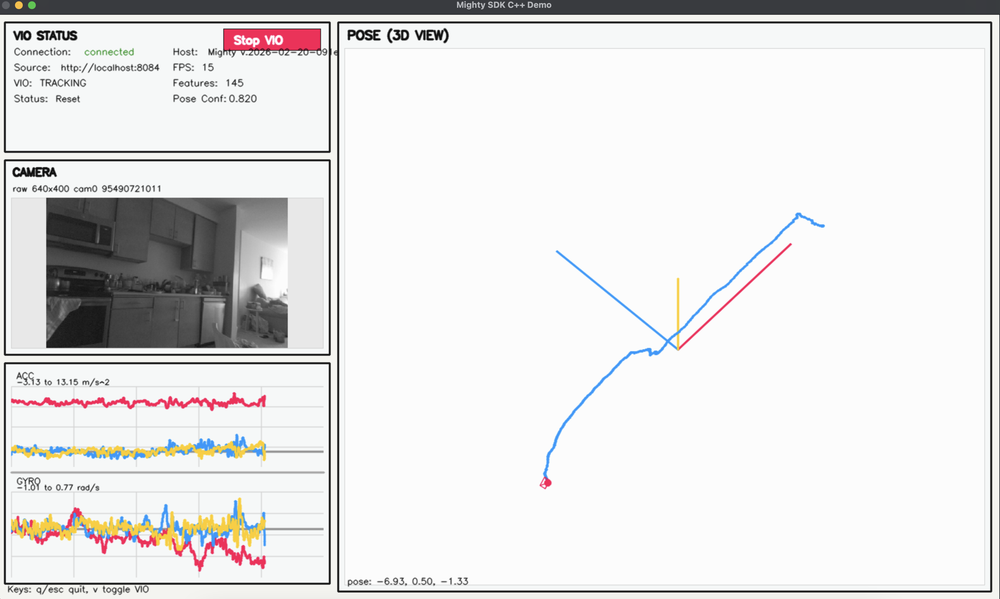

Available examples in the repository:

- Python GUI app: [`examples/python/`](https://github.com/asadm/mighty-protocol/tree/main/examples/python)
- Web dashboard app: [`examples/web/`](https://github.com/asadm/mighty-protocol/tree/main/examples/web)
- C++ dashboard app: [`examples/cpp/`](https://github.com/asadm/mighty-protocol/tree/main/examples/cpp)
- Test suites: [`tests/`](https://github.com/asadm/mighty-protocol/tree/main/tests)

### Python Example

Code: [`examples/python/`](https://github.com/asadm/mighty-protocol/tree/main/examples/python)

[](https://github.com/asadm/mighty-protocol/tree/main/examples/python)

### Web Example

Code: [`examples/web/`](https://github.com/asadm/mighty-protocol/tree/main/examples/web)

[](https://github.com/asadm/mighty-protocol/tree/main/examples/web)

### C++ Example

Code: [`examples/cpp/`](https://github.com/asadm/mighty-protocol/tree/main/examples/cpp)

[](https://github.com/asadm/mighty-protocol/tree/main/examples/cpp)

Run all tests from `mighty-protocol/`:

```bash
./tests/run_tests.sh
```
