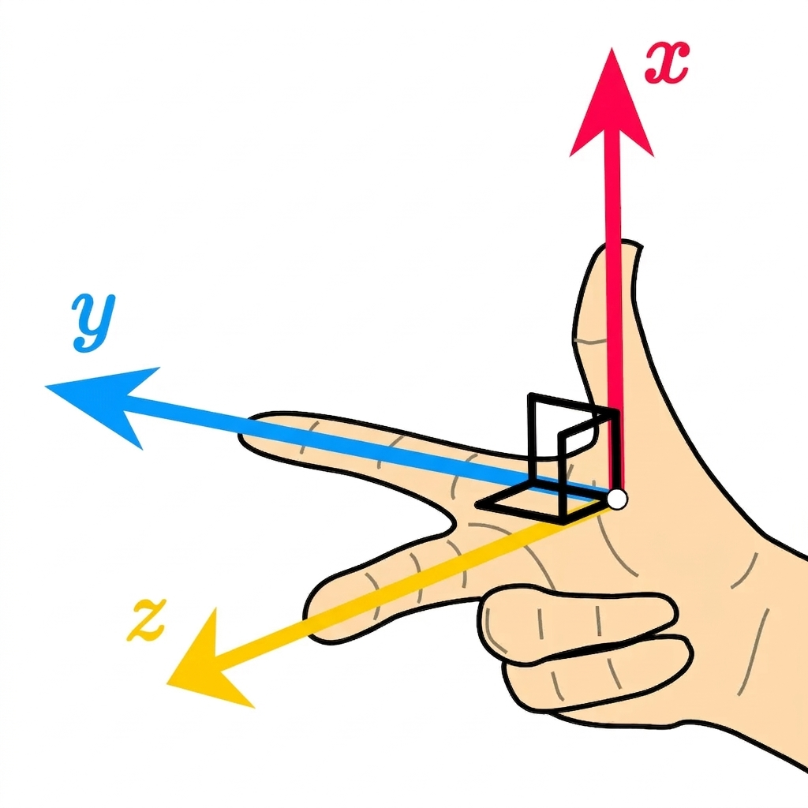

This guide describes how to read pose data from Mighty Camera and how to make sense of the coordinate system and map it for your system.

## Pose Output Summary

Each pose sample contains:

- body position in local world (`position_m` / `positionM`)
- body orientation quaternion (`orientation_xyzw` / `orientationXyzw`)
- body-frame linear and angular velocity
- timestamp and confidence

Frame labels in SDK callbacks:

- world frame: `odom`
- body frame: `base_link`

Units and ordering:

- position: meters
- quaternion: `xyzw`
- linear velocity: m/s (body frame)
- angular velocity: rad/s (body frame)
- timestamp: nanoseconds

## Coordinate Conventions

- `odom`: ENU, right-handed
- `base_link`: FLU, right-handed

Interpretation:

- pose is body-in-world (`base_link` in `odom`)
- velocity terms are expressed in body frame



## SDK Field Reference

| Field | Meaning | Frame | Units |
|---|---|---|---|
| `frame_id` / `frameId` | world frame name | `odom` | n/a |
| `child_frame_id` / `childFrameId` | body frame name | `base_link` | n/a |
| `position_m` / `positionM` | body origin position | `odom` | m |
| `orientation_xyzw` / `orientationXyzw` | body orientation | `odom` | unit quaternion |
| `linear_velocity_body_mps` / `linearVelocityBodyMps` | linear velocity | `base_link` | m/s |
| `angular_velocity_body_rps` / `angularVelocityBodyRps` | angular velocity | `base_link` | rad/s |
| `timestamp_ns` / `timestampNs` | sample time | stream/device clock | ns |
| `confidence` | tracking confidence | scalar | `[0,1]` |

## SDK Examples

### JavaScript

```js
client.onPose((p) => {
  const [x, y, z] = p.positionM;
  const [qx, qy, qz, qw] = p.orientationXyzw;
  const vBody = p.linearVelocityBodyMps;
  const wBody = p.angularVelocityBodyRps;
  console.log({ x, y, z, qx, qy, qz, qw, vBody, wBody, t: p.timestampNs, c: p.confidence });
});
```

### Python

```python
client.on_pose(lambda p: print({
    "frame": (p["frame_id"], p["child_frame_id"]),
    "pos": p["position_m"],
    "quat_xyzw": p["orientation_xyzw"],
    "v_body": p["linear_velocity_body_mps"],
    "w_body": p["angular_velocity_body_rps"],
    "ts": p["timestamp_ns"],
    "confidence": p["confidence"],
}))
```

### C++

```cpp
client.on_pose([](const PoseFrame& p) {
  // p.position_m, p.orientation_xyzw
  // p.linear_velocity_body_mps, p.angular_velocity_body_rps
});
```

## Integration Patterns

### ROS-style odometry consumers

Direct mapping is typically:

- `header.frame_id = "odom"`
- `child_frame_id = "base_link"`
- `pose.pose <- position + orientation`
- `twist.twist <- body-frame velocities`

### three.js and custom viewers

If your render world differs from ENU/FLU, apply a client remap:

```js
const R_VIZ_FROM_ODOM = [
  [ 0, -1,  0],
  [ 0,  0,  1],
  [-1,  0,  0],
];

// p_viz = R_viz_from_odom * p_odom
// q_viz = q_viz_from_odom * q_odom_body
```

Reference implementations in this repo:

- `examples/web/uihelpers.js` (`mapCanonicalPoseToViz`)
- `examples/python/mightyapp.py` (`_map_position_odom_to_viz`, `_map_quat_odom_to_viz`)
- `examples/cpp/main.cpp` (`map_pose_position_odom_to_viz`, `map_pose_quat_odom_to_viz`)

### NED/FRD downstream consumers

Apply conversion in your adapter layer:

- world: ENU -> NED
- body: FLU -> FRD

## Integration Checks

Use these checks when validating a new integration:

1. Stationary device: angular velocity near zero, position stable.
2. Slow yaw rotation: rotation direction follows right-hand rule.
3. Forward motion: forward velocity sign matches your body-axis expectation.
4. Visualized trajectory: no unintended mirror or 90/180° rotation.

## Image Credits

- 3D coordinate axes image: Wikimedia Commons ([`3D_coordinate_system.svg`](https://commons.wikimedia.org/wiki/File:3D_coordinate_system.svg))
- Right-hand-rule axes image: Wikimedia Commons ([`Cartesian-axes-right-hand-rule.svg`](https://commons.wikimedia.org/wiki/File:Cartesian-axes-right-hand-rule.svg))
