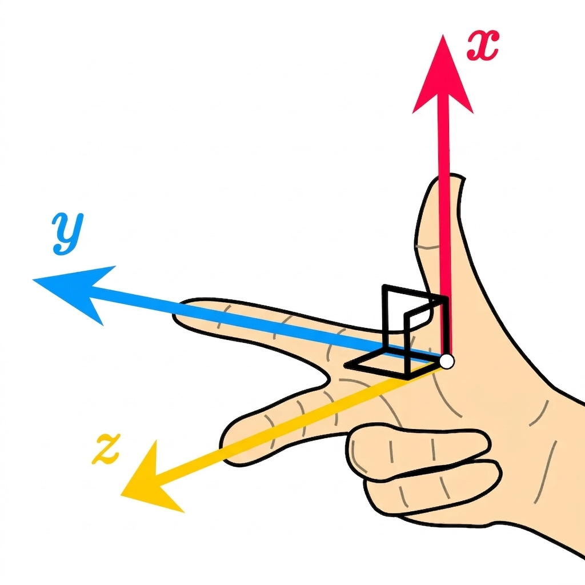

This guide describes how to read pose data from Mighty Camera and how to make sense of the coordinate system and map it for your system.

## Pose Output Summary

Each pose sample contains:

- body position in local world (`position_m` / `positionM`)
- body orientation quaternion (`orientation_xyzw` / `orientationXyzw`)
- body-frame linear and angular velocity
- timestamp and pose-usability confidence

Frame labels in SDK callbacks:

- world frame: `odom`
- body frame: `base_link`

Units and ordering:

- position: meters
- quaternion: `xyzw`
- linear velocity: m/s (body frame)
- angular velocity: rad/s (body frame)
- timestamp: nanoseconds

## Coordinate Conventions

- `odom`: ENU, right-handed
- `base_link`: FLU, right-handed

Interpretation:

- pose is body-in-world (`base_link` in `odom`)
- velocity terms are expressed in body frame



## SDK Field Reference

| Field | Meaning | Frame | Units |
|---|---|---|---|
| `frame_id` / `frameId` | world frame name | `odom` | n/a |
| `child_frame_id` / `childFrameId` | body frame name | `base_link` | n/a |
| `position_m` / `positionM` | body origin position | `odom` | m |
| `orientation_xyzw` / `orientationXyzw` | body orientation | `odom` | unit quaternion |
| `linear_velocity_body_mps` / `linearVelocityBodyMps` | linear velocity | `base_link` | m/s |
| `angular_velocity_body_rps` / `angularVelocityBodyRps` | angular velocity | `base_link` | rad/s |
| `timestamp_ns` / `timestampNs` | sample time | stream/device clock | ns |
| `confidence` | ordinal pose usability | scalar | `[0,1]` |

## Pose Usability

`confidence` tells an application which components of the current pose it may
use. It is not a probability that the position is globally accurate.

| Confidence | Meaning | Application action |
|---|---|---|
| `>= 0.5` | Synchronized full 6DoF output is available | Position and orientation may be consumed |
| `>= 0.2` and `< 0.5` | Translation is deliberately held; orientation remains useful | Use orientation only; do not interpret position changes as current translation |
| `< 0.2` | Full 6DoF output is unavailable | Do not consume the full pose; inspect VIO state and follow its recovery guidance |

Within the full-6DoF band, a larger value indicates stronger current visual
support. It does not certify absolute position or expose drift that the current
camera and IMU measurements cannot observe. Applications should consume
`onPose` / `on_pose` together with `onVioState` / `on_vio_state`.

During `DEGRADED` or `RECOVERING`, a pose sample may still contain the last held
position. That position is provided for continuity; it is not a new translation
measurement.

## VIO Pose States

The VIO state is the categorical explanation and action signal associated with
pose usability. State numbers are wire-stable and append-only.

| Value | State | Pose meaning | Application or user action |
|---:|---|---|---|
| `0` | `OFF` | VIO is not running and no current pose is available | Start VIO before consuming pose |
| `1` | `INITIALIZING` | VIO is estimating its initial gravity, scale, biases, and pose; a valid full pose is not available yet | Keep the device still unless the reported initialization reason asks for motion; wait for `TRACKING` |
| `2` | `TRACKING` | Synchronized position and orientation are available as full 6DoF output | Full pose may be consumed; continue monitoring state and confidence |
| `3` | `DEGRADED` | Translation is deliberately held and is not a current physical translation measurement; orientation remains useful | Use orientation only and wait for `TRACKING` before resuming translation use |
| `4` | `LOST` | VIO can no longer provide a trustworthy pose | Stop consuming pose; restore visible features and stable sensor input, then restart or wait for recovery |
| `5` | `LOW_LIGHT` | Image quality is too dark for reliable visual tracking and VIO is paused or unavailable | Improve lighting or exposure conditions; do not consume full pose until tracking resumes |
| `6` | `RECOVERING` | VIO detected an unsafe translational state, is holding the last position, and is rebuilding estimator state | Do not consume full 6DoF; keep the device still until the state returns to `TRACKING` |

The corresponding confidence behavior for Mighty VIO is:

- `TRACKING` reports confidence in `[0.5, 1.0]`.
- `DEGRADED` reports orientation-only usability, currently `0.25`.
- `RECOVERING` reports `0.0`.
- States without a valid current pose report `0.0` or do not emit a pose.

Always follow the more restrictive signal. For example, if an application has
not yet received a confidence value corresponding to a new non-tracking VIO
state, the state takes precedence.

## SDK Examples

### JavaScript

```js
client.onPose((p) => {
  const [x, y, z] = p.positionM;
  const [qx, qy, qz, qw] = p.orientationXyzw;
  const vBody = p.linearVelocityBodyMps;
  const wBody = p.angularVelocityBodyRps;
  console.log({ x, y, z, qx, qy, qz, qw, vBody, wBody, t: p.timestampNs, c: p.confidence });
});
```

An application can gate component use directly:

```js
client.onPose((p) => {
  if (p.confidence >= 0.5) {
    useFullPose(p.positionM, p.orientationXyzw);
  } else if (p.confidence >= 0.2) {
    useOrientationOnly(p.orientationXyzw);
  } else {
    stopUsingFullPose();
  }
});

client.onVioState((s) => {
  if (s.state === 6) {
    showGuidance("Keep the device still");
  }
});
```

### Python

```python
client.on_pose(lambda p: print({
    "frame": (p["frame_id"], p["child_frame_id"]),
    "pos": p["position_m"],
    "quat_xyzw": p["orientation_xyzw"],
    "v_body": p["linear_velocity_body_mps"],
    "w_body": p["angular_velocity_body_rps"],
    "ts": p["timestamp_ns"],
    "confidence": p["confidence"],
}))
```

### C++

```cpp
client.on_pose([](const PoseFrame& p) {
  // p.position_m, p.orientation_xyzw
  // p.linear_velocity_body_mps, p.angular_velocity_body_rps
});
```

## Integration Patterns

### ROS-style odometry consumers

Direct mapping is typically:

- `header.frame_id = "odom"`
- `child_frame_id = "base_link"`
- `pose.pose <- position + orientation`
- `twist.twist <- body-frame velocities`

### three.js and custom viewers

If your render world differs from ENU/FLU, apply a client remap:

```js
const R_VIZ_FROM_ODOM = [
  [ 0, -1,  0],
  [ 0,  0,  1],
  [-1,  0,  0],
];

// p_viz = R_viz_from_odom * p_odom
// q_viz = q_viz_from_odom * q_odom_body
```

Reference implementations in this repo:

- `examples/web/shared/uihelpers.js` (`mapCanonicalPoseToViz`)
- `examples/python/mightyapp.py` (`_map_position_odom_to_viz`, `_map_quat_odom_to_viz`)
- `examples/cpp/dashboard/main.cpp` (`map_pose_position_odom_to_viz`, `map_pose_quat_odom_to_viz`)

### NED/FRD downstream consumers

Apply conversion in your adapter layer:

- world: ENU -> NED
- body: FLU -> FRD

## Integration Checks

Use these checks when validating a new integration:

1. Stationary device: angular velocity near zero, position stable.
2. Slow yaw rotation: rotation direction follows right-hand rule.
3. Forward motion: forward velocity sign matches your body-axis expectation.
4. Visualized trajectory: no unintended mirror or 90/180° rotation.
5. Degraded state: downstream translation use stops while orientation remains
   responsive.
6. Recovering state: the application asks the user to keep the device still and
   does not consume full 6DoF until tracking resumes.

## Image Credits

- 3D coordinate axes image: Wikimedia Commons ([`3D_coordinate_system.svg`](https://commons.wikimedia.org/wiki/File:3D_coordinate_system.svg))
- Right-hand-rule axes image: Wikimedia Commons ([`Cartesian-axes-right-hand-rule.svg`](https://commons.wikimedia.org/wiki/File:Cartesian-axes-right-hand-rule.svg))
