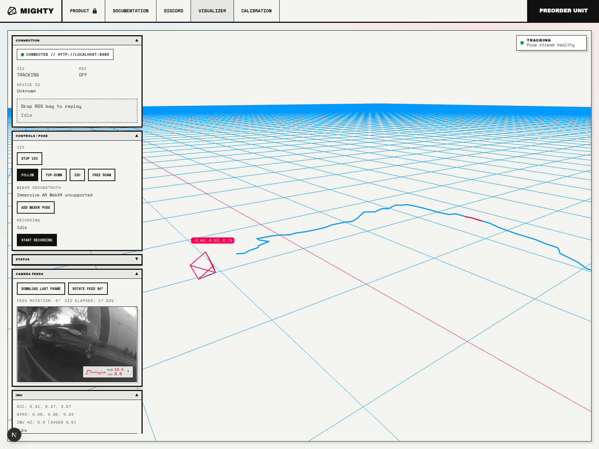
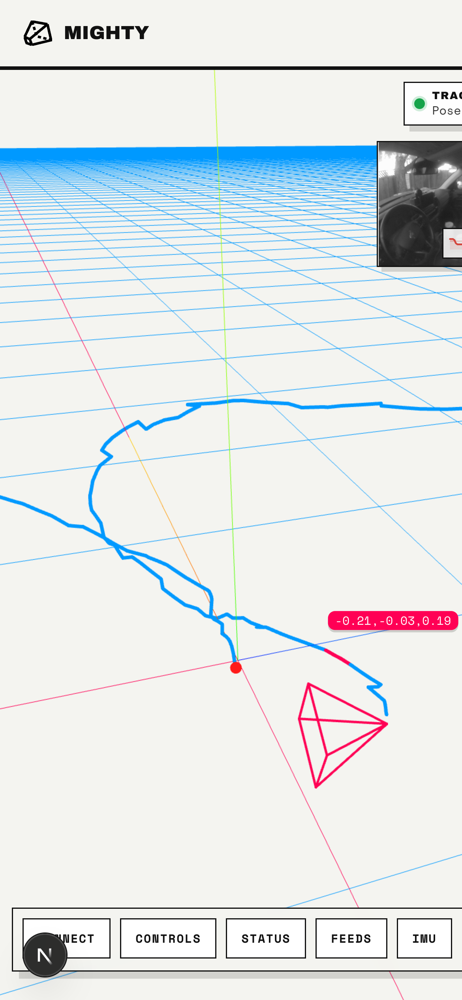

You can test Mighty Camera directly from the browser. The Visualizer Playground
connects to the board and shows live camera, IMU, and VIO data without writing
code or installing a local app.

## Try the visualizer

1. Plug Mighty Camera into your machine.
2. Open Chrome, Chromium, Edge, or Safari.
3. Browse to [mightycamera.com/viz](https://mightycamera.com/viz) and wait for
   the board to connect.
4. Once connected, use the sidebar to inspect live camera and IMU data.
5. Click **Start VIO** to see the board estimate pose in real time.

The visualizer is the quickest way to confirm that the board is connected, the
sensors are streaming, and VIO is running before integrating it into your own
software.

## Recording

You can record a ROS bag v1 file directly from the visualizer, including camera,
IMU, and pose streams. Click **Start Recording**, then **Stop Recording** when
you are done. The visualizer will download a `.bag` file that you can replay
later in the visualizer or analyze offline.

## Mobile and tablet

Mighty also works from a phone or tablet because the board includes its own web
server and visualizer. This is useful when testing on the go without carrying a
laptop.

1. Plug Mighty Camera into your iOS or Android device over USB.
2. Turn off Wi-Fi on the phone or tablet so the browser uses the USB network
   connection to Mighty.
3. Open the browser and visit [http://192.168.7.1](http://192.168.7.1).

