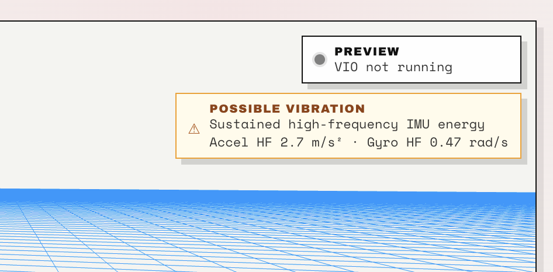
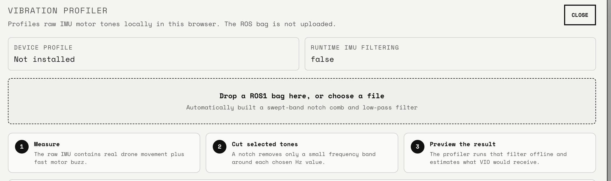
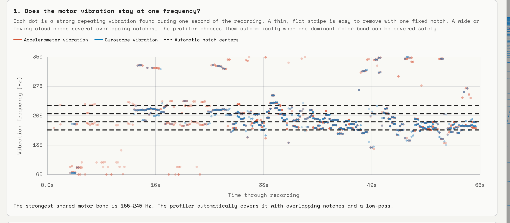
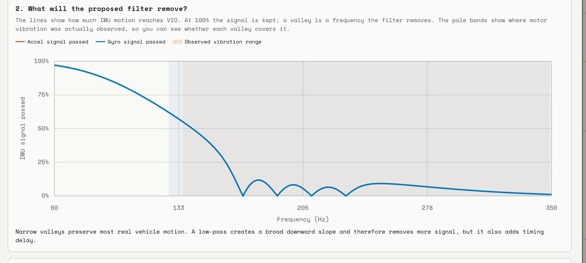
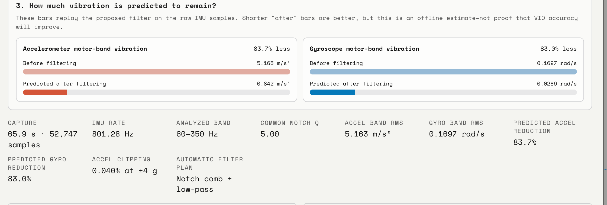
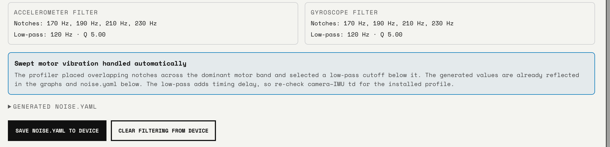

## Why vibration control matters

VIO works best when the camera and IMU describe the same rigid motion. On a
drone, RC car, or other motorized platform, vibration adds rapid acceleration
and rotation that is not useful vehicle motion. The estimator can mistake that
noise for real movement, making initialization less reliable and degrading
position, orientation, and velocity estimates. At the same time, vibration can
blur images or let a flexible mount move the camera independently of the IMU.

A good mechanical mount protects the measurements before they reach the
estimator. This is important because filtering cannot reconstruct clipped IMU
samples, undo motion blur, or repair camera-to-IMU flex. Mighty's Vibration
Profiler handles the repeatable in-band motor noise that remains after the
platform and mount have been improved.

Reduce vibration mechanically first, then use the profiler as the second line
of defense. The ArduPilot guides to
[gyro notch filtering](https://ardupilot.org/copter/docs/common-imu-notch-filtering.html)
and [vibration damping](https://ardupilot.org/copter/docs/common-vibration-damping.html)
provide a useful, more detailed treatment of the same problem.

## Reduce vibration at the source and mount

Use the final vehicle configuration before profiling: the same motors, props or
wheels, payload, fasteners, wiring, and camera position that you plan to run.

- Balance propellers and wheels. Check motor shafts, bearings, prop adapters,
  gears, and driveline parts for damage, play, or eccentricity.
- Tighten motor, arm, frame, and camera-carrier fasteners. A stiff frame and a
  stiff local mounting surface prevent flex from creating additional resonances.
- Place Mighty near a rigid, central part of the platform when practical, away
  from motors, gearboxes, and flexible frame ends.
- Keep the camera and IMU rigidly related. Mount the complete Mighty module to a
  small rigid carrier; do not let the lens, sensor board, or connector move
  independently.
- Isolate that carrier with small foam or silicone-gel pads, silicone grommets,
  rubber bobbin dampers, or an O-ring suspension plate. Use a light safety
  restraint that does not compress the isolators solid.
- Match the isolator to the supported mass. A mount that is too hard passes
  motor buzz; one that is too soft can rock during real vehicle motion or create
  a new low-frequency resonance. More foam is not automatically better.
- Use flexible wire loops and strain relief. A tight USB or power cable can form
  a hard vibration bridge around an otherwise good isolating mount.

## Check damping in the Visualizer

The Visualizer provides a quick live check before you record a full profiling
bag. When it detects sustained high-frequency IMU energy or accelerometer
clipping, a yellow **Possible Vibration** warning appears in the upper-right
corner.

**Accel HF** and **Gyro HF** are the recent high-frequency RMS levels measured
from the raw IMU stream. Use them as comparative indicators: run the motors at
the same speed and under the same conditions before and after changing the
mount. Lower values, or a warning that no longer appears, indicate that less
high-frequency vibration is reaching Mighty.

If the warning persists, improve the vibration source or mount and consider
creating a noise-filter profile. If it reports accelerometer clipping, address
that first because no software filter can recover saturated samples. The live
warning is a screening tool, not proof that VIO will succeed or fail; the bag
profiler is still needed to identify the frequencies and evaluate a filter.

After changing the mount, repeat the same operating test and compare the bag
profiler's accelerometer and gyroscope motor-band RMS values as well.

## Record a representative maiden run

Record the raw IMU under the conditions the profile must cover. For a drone,
include the expected hover and throttle range. For an RC car or robot, include
the normal motor speeds, acceleration, terrain, and steering loads.

1. Install the SD card and put Mighty in idle/preview mode with VIO stopped.
2. Long-press the camera button for about two seconds, then release it. The LED
   shows three quick flashes followed by a pause while recording.
3. Begin with a few seconds of motors-off data, then run a safe, controlled test
   through the normal operating range. Avoid profiling only one unusually quiet
   speed.
4. Press and release the button to stop the recording normally.
5. Copy the resulting ROS1 `.bag` file from the SD card to your computer.

See [Recording](/docs/recording) for the complete SD-card recording workflow,
LED states, topics, and troubleshooting. Board-side recording and VIO are
mutually exclusive. That is expected here: the bag records raw `/imu0` samples
for offline analysis rather than recording an already-filtered VIO input.

Create a new profile after changing props, wheels, motors, gearing, payload,
mount stiffness, isolators, or the Mighty mounting location. The profiler can
only cover the vibration envelope present in the bag.

## Drop the bag into the Vibration Profiler

1. Connect Mighty Camera and open the
   [Visualizer](https://mightycamera.com/viz).
2. Under **Device Settings**, find **Vibration Filtering** and click
   **Vibration Profiler**.
3. Drop the ROS1 `.bag` onto the dashed area, or click it to choose the file.
4. Wait for the browser to extract and analyze the IMU samples.

The analysis runs locally in the browser; the ROS bag is not uploaded. **Device
profile** reports whether `noise.yaml` is installed on the connected camera.
**Runtime IMU filtering** reports whether the currently running VIO instance
actually loaded a filter profile.

## Read the profile

### 1. Vibration frequency over time

Each red accelerometer or blue gyroscope dot is a strong repeating frequency
found in a one-second window of the recording. Time runs left to right and
frequency in hertz runs bottom to top. Dashed horizontal lines are the proposed
notch centers.

A thin, nearly horizontal stripe is a compact tone that a fixed notch can
target. A tone that moves with motor speed appears as a wider or sloped cloud;
the profiler may cover one dominant swept band with several overlapping
notches and a low-pass filter. If the capture has no dominant, safely coverable
band, the profiler does not generate an installable automatic profile.

### 2. Proposed filter response

This plot shows the percentage of IMU motion that would reach VIO at each
frequency. `100%` means the signal is preserved. Each narrow valley is a notch
that rejects a selected motor tone. The pale vertical regions mark frequencies
where vibration was observed, so the valleys should cover those regions.

A broad downward slope comes from a low-pass stage. It can cover a swept motor
band, but it removes more high-frequency motion and adds timing delay. Validate
VIO carefully after installing a profile with a low-pass stage; substantial
filter changes can require re-checking camera-to-IMU timing calibration.

### 3. Predicted reduction and capture quality

The profiler replays the proposed filter over the bag's raw IMU samples. The
shorter **Predicted after filtering** bars and reduction percentages estimate
how much motor-band RMS would remain. This is an offline signal estimate, not a
guarantee that VIO accuracy will improve; a real VIO run is still the final
test.

The summary below the bars reports capture duration, inferred IMU rate,
analyzed frequency band, notch `Q`, raw motor-band RMS, predicted reduction,
and accelerometer clipping. Higher `Q` means a narrower notch. Treat clipping
as a mechanical or sensor-range problem before relying on filtering.

## Save the profile to Mighty

The filter cards list the proposed accelerometer and gyroscope notch centers,
low-pass cutoff, and common `Q`. Review the result, keep the camera connected,
then click **Save noise.yaml to Device**. Saving is disabled when the profiler
cannot identify a reliable automatic plan.

Saving writes `noise.yaml` to the camera. It does not hot-reload a VIO instance
that is already running: stop and start VIO again, or restart the camera. After
startup, **Device profile** should show that the file is installed and
**Runtime IMU filtering** should show `true` while filtered VIO is running.

Use **Clear Filtering from Device** to remove the profile, then restart VIO to
return to unfiltered estimator input.

## Exactly what Mighty filters

The filter is applied to raw accelerometer and gyroscope samples immediately
before they enter Polaris VIO. It is not a post-filter on pose, and it does not
replace the raw IMU stream sent to other consumers.

| Consumer | Data it receives when `noise.yaml` is active |
| --- | --- |
| Polaris VIO frontend and estimator | Filtered accelerometer and gyroscope samples |
| VIO pose, velocity, and tracking output | Estimated using the filtered IMU; the pose itself is not post-filtered |
| Web Visualizer and SDK raw IMU stream | Raw, unfiltered IMU samples |
| ROS bag recording (`/imu0`) | Raw, unfiltered IMU samples |
| IMU health diagnostics | Raw, unfiltered IMU samples |

Recordings also embed the active profile as `/noise` metadata. On replay, Mighty
can apply that embedded profile to the VIO input while `/imu0` remains raw. This
preserves the original measurements and makes the filtering choice
reproducible.

Mighty currently installs fixed causal filter stages derived from the recorded
operating envelope; it does not track live motor RPM. If the motor band later
moves outside that envelope, capture a broader representative run and generate
a new profile. Filtering cannot repair accelerometer clipping, above-Nyquist
vibration that has already aliased into the sampled band, motion blur, or
physical flex between the camera and IMU.
