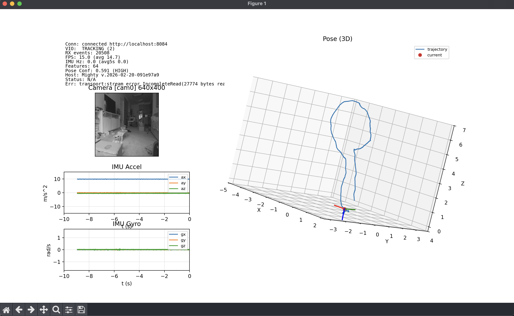

# Python Examples

This folder contains Python examples for the Mighty protocol SDK.

## Preview



## Live VIO Dashboard

Main script: `mightyapp.py`

Support module: `uihelpers.py` (UI/layout/rendering + plotting helpers)

Features:
- Streams camera image.
- Shows VIO status.
- Plots IMU accel/gyro traces.
- Plots 3D pose trajectory.

## Dependencies

Required:
- `python >= 3.9`
- `numpy`
- `matplotlib`

Optional:

Install:

```bash
pip install numpy matplotlib
```

Using `venv` (recommended), from the root of repository:

```bash
python3 -m venv .venv
source .venv/bin/activate
pip install --upgrade pip
pip install numpy matplotlib
```

## Run

```bash
source .venv/bin/activate
cd examples/python
python3 mightyapp.py
```
