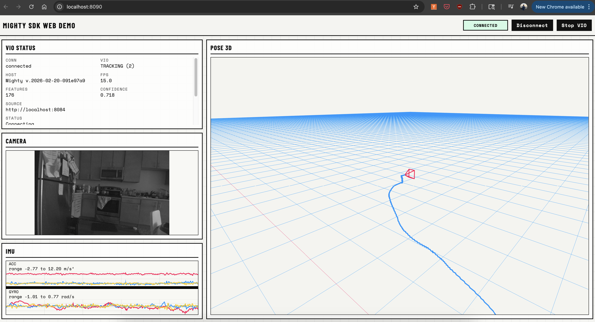

# Web Example (Vanilla JS + Vite)

This example shows SDK usage in plain browser JS using npm modules:
- `main.js`: SDK/device/client usage
- `uihelpers.js`: UI rendering helpers
- `style.css`: lightweight CMYK-inspired styling

## Preview



Dependencies:
- `mighty-protocol` from local path (`file:../..`)
- `three` from npm
- Vite for dev server

## Run

From the `mighty-protocol/examples/web` directory:

```bash
npm install
npm run dev
```

Open the local URL printed by Vite (default `http://localhost:8090`).

## Notes

- Uses SDK defaults via `new MightyWebDevice()`.
- If your device host differs, update `vite.config.js` proxy target or pass explicit hosts in code.
